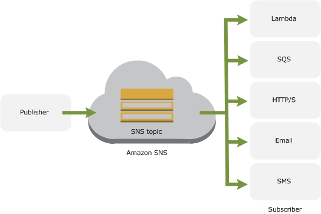
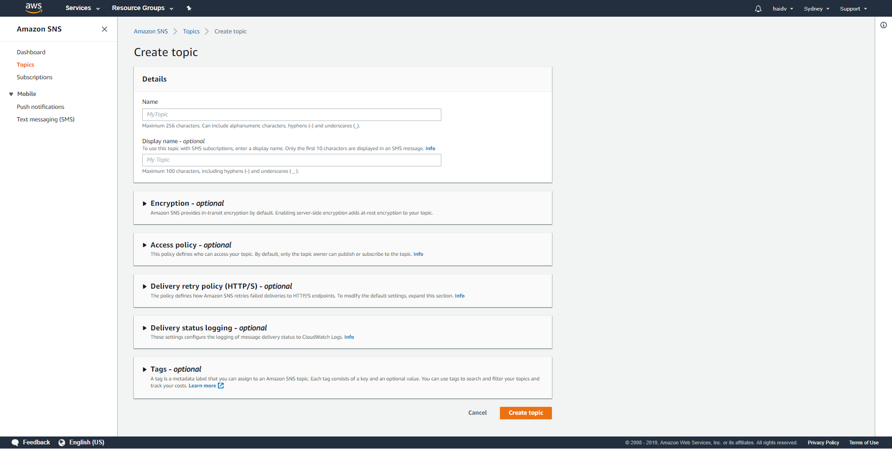
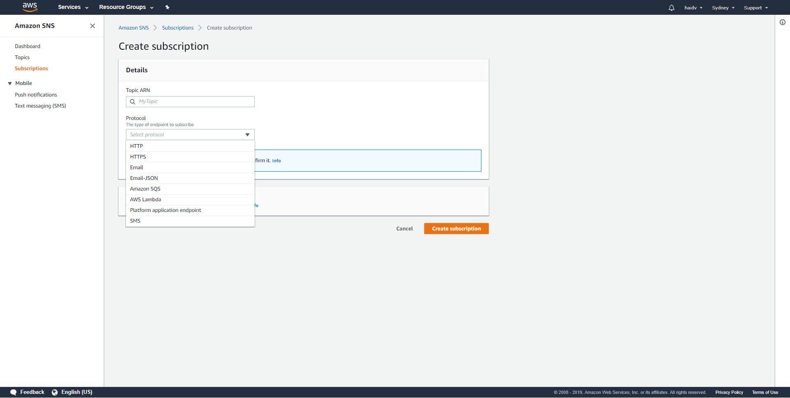
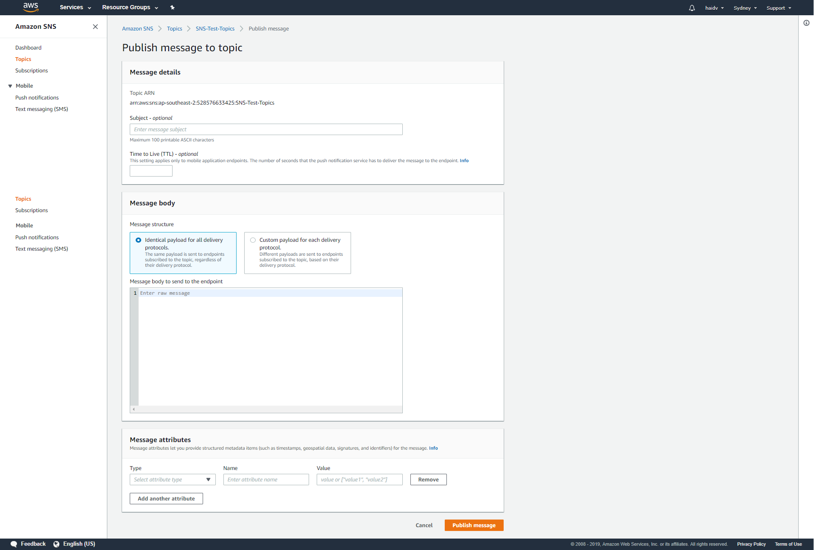

__Amazon Simple Notification Service__ (Amazon SNS) is a web service that coordinates and manages the delivery or sending of messages to subscribing endpoints or clients.

  
  

In Amazon SNS, there are two types of clients—publishers and subscribers—also referred to as producers and consumers.

  

- __Publishers__ communicate asynchronously with subscribers by producing and sending a message to a topic, which is a logical access point and communication channel

- __Subscribers__ (i.e., web servers, email addresses, Amazon SQS queues, AWS Lambda functions) consume or receive the message or notification over one of the supported protocols (i.e., Amazon SQS, HTTP/S, email, SMS, Lambda) when they are subscribed to the topic.

  
 
  
  

Common use case you can take advantage of SNS:

  

- __Fanout__: The "fanout" scenario is when an Amazon SNS message is sent to a topic and then replicated and pushed to multiple Amazon SQS queues, HTTP endpoints, or email addresses. This allows for parallel asynchronous processing. For example, you could develop an application that sends an Amazon SNS message to a topic whenever an order is placed for a product. Then, the Amazon SQS queues that are subscribed to that topic would receive identical notifications for the new order. The Amazon EC2 server instance attached to one of the queues could handle the processing or fulfillment of the order while the other server instance could be attached to a data warehouse for analysis of all orders received.

  

	

  

- __Application and System Alerts__: Application and system alert, when they are trigger by exceeding predefined threshold, could be seen as notification through SNS

- __Push Email and Text Messaging__: Push email and text messaging are two ways to transmit messages to individuals or groups via email and/or SMS. For example, you could use Amazon SNS to push targeted news headlines to subscribers by email or SMS.

- __Mobile Push Notifications__: Mobile push notifications enable you to send messages directly to mobile apps. For example, you could use Amazon SNS for sending notifications to an app

  

## Topic

  
  
  

Topics are the fundamental concept for message routing in a pub-sub architecture: Many subscribers listen to a topic and are notified whenever something publishes a message on that topic. The concept is similar to the mailing lists (which would be our themes) and the people who sign up to receive the emails (which would be the subscribers).

  

Create a topic is very simple by following these steps:

  

First we will access the AWS console , and from the drop-down menu Services we will choose (or look for) SNS.

  

If we see the welcome cover of SNS, we will click on “Get started” to access the work screen.

  

On the main screen, we select “Create topic” to create a new topic.

  
  

  

Now, we must indicate the name and a brief description (up to 10 characters) for our SNS, and click on the “Create topic” button.

  
  

## Subscribing to a topic

  
  
  

To retrieve a published message from topic, you need to create subscription.

  

AWS SNS support a bunch of protocol for subscription for your desired design

- HTTP

- HTTPS

- Email

- Email-JSON

- Amazon SQS

- Amazon Lambda

- Platform application endpoint

- SMS

  
  

  
  

After creating subscription, in the first time, you must confirm subscription to retrieve the message from your topic by visiting `SubscriberURL` in the response body (`GET` method).

  

In case your protocol is `email`, you 'll be retrieved confirmed subscription email which contains the link to confirm subscription. All you need to do is clicking the link, it's done

  
  

## Publishing A Message to Topic

  

Once you 've setup your topic and confirm subscription, you can publish your message

  

To publish message in a topic, go your SNS, click on "Publish to topic" button

  
  

  

you will be asked to indicate the subject of the notification (optinal), the content (we can indicate that it is raw and write any message), and clicking on “Publish message” will be sent to all subscribers.

  

## Pricing

  

- Publishes

- Includes publish, topic owner operations, and subscriber operations, but not deliveries

- First 1 million Amazon SNS requests per month are free

- $0.50 per 1 million Amazon SNS requests thereafter

- Amazon SNS currently allows a maximum limit of 256 KB for published messages. Each 64KB chunk of published data is billed as 1 request. For example, a single API call with a 256KB payload will be billed as four requests.

  
  

- Notification deliveries

- Platform application endpoint: 0.5$ per 1M transmission

- SMS: differ in each region

- email/email-JSON: $2 per 100 000

- HTTP/s: $0.6 per 1M

  

- Each 64KB chunk of delivered data is billed as 1 request. For example, a single notification with a 256KB payload will be billed as four deliveries.

  
  
  

## References

  

- Amazon Simple Notification Service Sample: _https://docs.aws.amazon.com/sdk-for-javascript/v2/developer-guide/sns-examples.html_

- Publishing AWS SNS messages to browsers: _https://deepstreamhub.com/blog/publishing-aws-sns-messages-to-browsers-tutorial/_

- What is Amazon Simple Notification Service?: _https://docs.aws.amazon.com/sns/latest/dg/welcome.html_

- Fanout pattern implementation with Serverless Framework: _https://github.com/GeminiWind/serveless-examples/tree/master/aws-fanout-example_

Tags: #aws, #sns