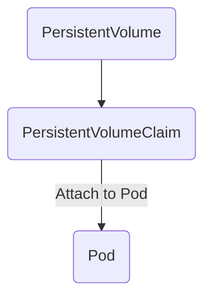

# Persistent Volume
-  Below is the basical flow to use storage in K8S. 
	1. crerate `Persistent Volume`. `Persintent Volume` is applied in cluster level.
	2. create `PersintentVolumeClaim`(PVC), it's something like smaller unit and is applied in pod level
	3. mount PVC to your container

-  K8s support variarty of storage:
	- NFS
	- Local
	- AWS EBS
	- GCP
	- the list go on
- Tips:
	- In produnction, NFS or block storage (AWS EBS) is recommended
	- Snapshot should be enabled for your volume

## Example

### NFS
```yaml
apiVersion: v1
kind: PersistentVolume
metadata:
  name: pv0003
spec:
  capacity:
    storage: 5Gi
  volumeMode: Filesystem
  accessModes:
    - ReadWriteOnce
  persistentVolumeReclaimPolicy: Recycle
  storageClassName: slow
  mountOptions:
    - hard
    - nfsvers=4.1
  nfs:
    path: /tmp
    server: 172.17.0.2
```

### Cluster disk

```yaml
apiVersion: v1
kind: PersistentVolume
metadata:
  name: task-pv-volume
  labels:
    type: local
spec:
  storageClassName: manual
  capacity:
    storage: 10Gi
  accessModes:
    - ReadWriteOnce
  hostPath:
    path: "/mnt/data"
```

# PersistentVolumeClaim

-  Pods use PersistentVolumeClaims to request physical storage

## Example

```yaml
apiVersion: v1
kind: PersistentVolumeClaim
metadata:
  name: task-pv-claim
spec:
  storageClassName: manual
  accessModes:
    - ReadWriteOnce
  resources:
    requests:
      storage: 3Gi
```

# Using volume in Pod

## Example

```yaml
apiVersion: v1
kind: Pod
metadata:
  name: task-pv-pod
spec:
  volumes:
    - name: task-pv-storage
      persistentVolumeClaim:
        claimName: task-pv-claim
  containers:
    - name: task-pv-container
      image: nginx
      ports:
        - containerPort: 80
          name: "http-server"
      volumeMounts:
        - mountPath: "/usr/share/nginx/html"
          name: task-pv-storage
```