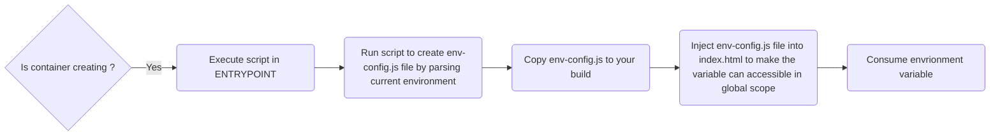

# Deploy React Application with run-time environment
## General idea
Our idea is that utilizing the `ENTRYPOINT` of `Dockerfile`. Whenever container has created, the script which is defined for `ENTRYPOINT` is executed

The flow is described as below



## Setup

### Setup to create env-config.js file

- `env-config.js` file responsible to create a global variable which contains the list of current environment variable. Below is the example content of this file
```js
    // File: ./env-config.js
	window._env = {
      FOO: 'foo',
	    BAR: 'bar'
	}
```
- To create this file, you can use any scripting language (NodeJs, Python). The script is implemented to read the current environment variable, store them in the object, then writing them to  expected `env-config.js` file. Below is the example of scripting written in NodeJs

```javascript
    // File: ./create-env-config.js
	const fs = require('fs');


	const publishableEnvKeys = ['FOO'];


	const config = {};


	publishableEnvKeys.forEach(key=> {

	  config[key] = process.env[key];

	});


	fs.writeFileSync('./env-config.js', `window._env =${JSON.stringify(config)};`);
```

- The last thing to do is injecting the `env-config.js` file into your `index.html` file to consume them later by `window._env.ENV_NAME`

```html
<script src\="<path to env-config.js file>/env-config.js"\></script\>
```
### Setup for local development

Ater setup to get the `env-config.js`, in the local development of developer, now, everything will be easier. The  easiest way is using `dontenv`.

- Step1: Creating your `.env` file, then specify your desired environment variable
```bash
// file: .env
FOO=foo
```
- Step2: Start your project by loading .env file, run script to create `env-config.js`, copy it to your build forlder file then we're good to go. Below is the example with project using `react-script`

```bash
node --require dotenv/config ./create-env-config && cp env-config.js ./public/ && react-scripts start
```

### Setup for containerization (Docker)
Belows are the steps to setup for containerization
- Step 1: Create `entrypoint.sh` file
 ```bash
 	#!/bin/sh
	 
	node ./create-env-config

  	# TODO: run the web server to host your static page (serve is recommend)
 ```

- Step2:  Specify your entrypoint to Dockerfile
```Dockerfile
# do other thing like install deps
 
COPY ./create-env-config.js ./entrypoint.sh


RUN chmod +x ./create-env-config.js ./startup.sh

# do other thing

ENTRYPOINT ["./startup.sh"]
```
### Consume environment variable

You can consume the environment varialble by the following syntax `windown.env.ENV_NAME`

Tags: #react, #devops